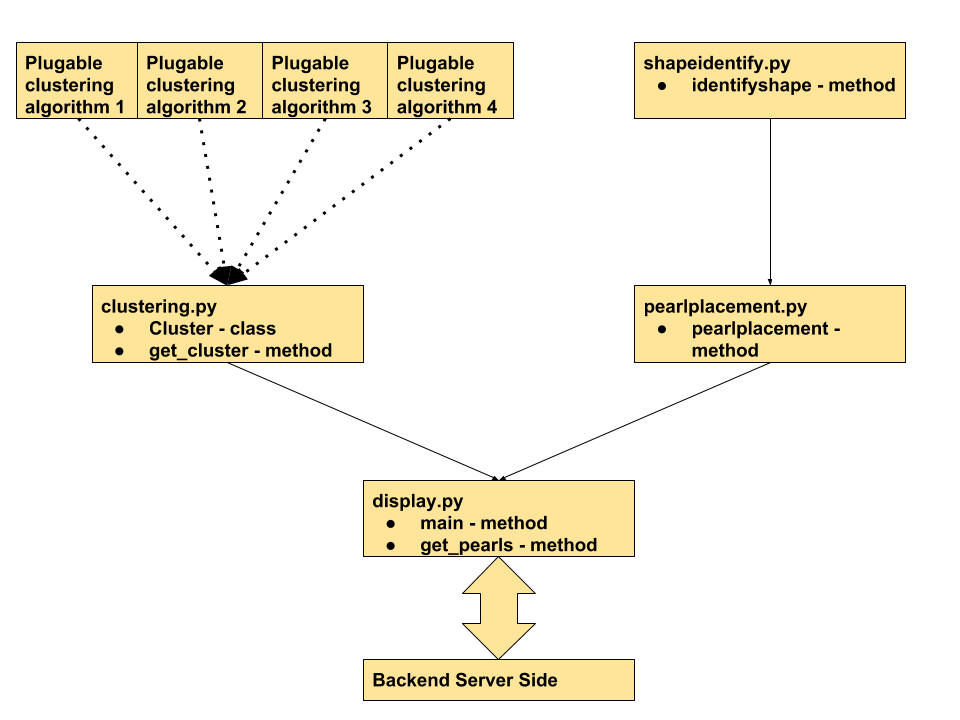

## Backend Implementation
### Basic architecture diagram

### display.py
This is main file interacting with server for parameters for PEARLS system.It provides to main methods:  
- main
    - Method Argument : (number of cluster, no of pearls, first algorithm, second algorithm, current file path, data dimension flag, number of bins)
    - Return Value : all_cluster_data, dimension, attributes
        - all_cluster_data : {cluster_number:{"pointName":{pearl_number:{strings}},
        "acpoints":{pearl_number:[list]},
        "shapes":{'s':shapes,'c':color},
        "cluster_centroid":{'x':float,'y':float,'z':float}}}
        - dimension : integer
        - attributes : list of strings  

### clustering.py
This file provides class for creating an object named **Cluster**. By using **Cluster** class as parent class using concept of abstract classes community can add clustering algorithm they need.  
Instruction for adding are :  
- Make a new python file
- Define class for your clustering algorithm inheriting from Cluster
- Implement **get_cluster** method following return signature of inbuilt kmeans function
- Add case for making object for your Cluster object in display.py [here]()

### pearlplacement.py
This file provides method for getting shape and position of pearl in a cluster. It returns dictionary with 'x','y','z','s' as keys with value being x-coordinate, y-coordinate, z-coordinate and shape.
