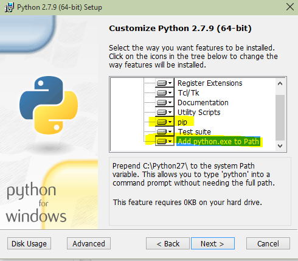

## Windows Installation Manual
1. Install python 2.7.15
    1. Download exe file from download page
        - [Python page link](https://www.python.org/downloads/release/python-2715/)
        - [PEARLS Drive Link](https://drive.google.com/drive/folders/1-BfSWXdeXX2IQMjMUW-u08Hq_koMLHUR?usp=sharing)
    2. Run installer and at the below page add **pip and python to path**
    
2. Next install virtualenv by running the given command
```sh
$ pip install virtualenv
```
3. Create virtual ennvironment by
```sh
$ cd C:\User\User\Documents
$ virtualenv pearls-env  
```
4. Next you have to activate your virtual ennvironment by
```sh
$ .\pearls-env\Scripts\activate
```
5. Next move to the your PEARLS repo
```sh
$ pip install -r requirments.txt
```
6. navigate to Backend/backend_server and run following and run django server
```sh
$ cd .\Backend\backend_server\
$ python manage.py runserver
```
7. Open index.html file from Frontend folder in your PEARLS repo in browser and you are ready to go. :)
